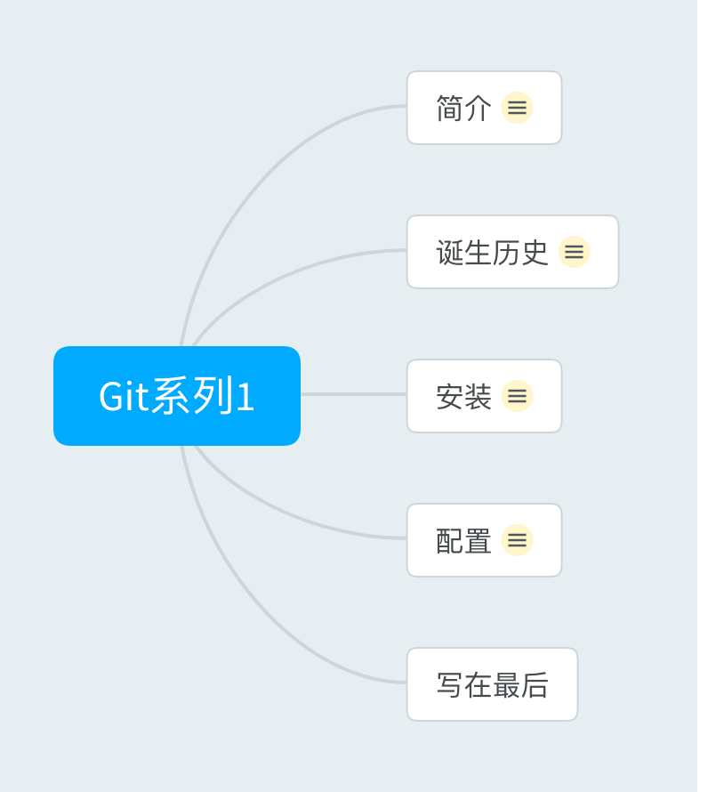

> 从今天起，将会陆续更新一个Git从入门到进阶的系列文章。

我个人觉得Git的使用不仅仅限于程序员，只要是涉及到协作与版本管理的地方，Git都应该算是一个不错的选择。

哪怕你已经使用过一段时间的Git，我相信我的文章也会对你有那么一点点启发，一点点帮助，其实，这就够了。

你可以通过思维导图快速了解文章的主要内容，以决定是否需要继续阅读。


#### 简介
先放上Git的官方地址 https://git-scm.com。简单翻译了一下Git官网对Git的介绍，大致内容如下：

Git是一个免费的开源分布式版本控制系统，旨在快速高效地处理从小型到大型项目的所有事务。
Git 易于学习，占地面积小，具有闪电般快速的性能。它超越了Subversion，CVS，Perforce和ClearCase等SCM工具，具有廉价的本地分支，便捷的临时区域和多工作流等功能。

简单来说，Git是一款这样的软件，可以对一个项目进行版本控制，这里的项目不限于代码工程或者是你自己的文件夹或者是自己的文稿等。只要是文件的形式，Git都可以帮助我们进行版本的控制，记录我们的每次版本的变更内容。
同时Git还提供了分支来进行多个工作流的多人协作。至于分支和工作流，后续的系列文章会详细介绍。

#### 诞生历史
Git是由“Linux之父”Linus Torvalds创造的，大概的历史背景是这样的。Linxu系统在开发之初，需要一款版本控制工具来进行代码的管理，当时使用的是BitKeeper这款工具，这款工具是商业收费软件，但是免费提供给Linux开源社区使用，有一天，Linux系统的贡献者之一Tridge(Samba创始人)想开发一个针对BitKeeper的插件，便研究逆向破解BitKeeper的协议，结果被BitKeeper所属的公司发现，不再继续免费给Linux开源社区提供服务，Linus Torvalds在交涉无果后，决定自己开发一款工具用来进行代码管理，然后Git就诞生了。

就是下面这个神一般的人开发出了Git。


这是Git工具开发的主要时间线:

- 2005年4月3日，开始开发Git。
- 2005年4月6日，项目发布。
- 2005年4月7日，Git就可以作为自身的版本控制工具了。 
- 2005年4月18日，发生第一个多分支合并。 
- 2005年4月29日，Git的性能就已经达到了Linus的预期。 
- 2005年6月16日，Linux核心2.6.12发布，那时Git已经在维护Linux核心的源代码了。 
#### 安装
1. Windows系统的安装
首先在下面的地址选择下载Git的安装包 https://git-scm.com/downloads
安装过程和一般的软件安装没有什么区别，直接一路下一步就可以安装完成。

2. Linux系统的安装
在Linux上一般使用命令行进行安装，这里只介绍一下Ubuntu上面的安装命令
```bash
sudo apt-get install git
```
然后输入密码等待安装完成就ok了。

3. Mac系统安装Git
一般的Mac系统是自带了Git，你可以在Terminal中输入git回车查看，如果有响应输出，就表示已经安装了，如果提示没有安装Git，可以使用下面的命令安装homebrew，通过它安装Git。

```bash
//安装homebrew
ruby -e "$(curl -fsSL https://raw.githubusercontent.com/Homebrew/install/master/install)"

//安装Git
brew install git
```
注意：上面安装homebrew的过程中可能下载比较慢，可以试试科学上网，或者是更换为国内镜像，这里不再详述。

由于安装软件是使用操作系统的基本要求，这里就不详细介绍了，安装完成后，大家可以打开命令行，在其中输入下面的命令，如果正确输出Git的版本号，则说明Git安装成功。
```bash
git --version
```
#### 配置
安装好Git以后就到了Git配置的部分了。这里主要介绍配置Git的用户名和邮箱。有些教程会还会让配置ssh密钥，这里由于暂时不涉及远程仓库，等后面远程仓库的系列会详细介绍。

由于Git是一个版本控制系统，所以你每次内容修改完想把本次作为一个版本记录一下，就需要手动提交一下你这次的文件变更，又由于Git支持多人协作，所以在你正式使用Git之前，你必须先通过配置来告诉Git你的基本信息，这里主要配置用户名和邮箱即可，这样多人协作的时候就知道某次内容变动是谁操作的。

我们一般使用下面的命令进行用户名和邮箱的配置

```bash
git config --global user.name "用户名"
git config --global user.email "邮箱"
```
这两行命令是给当前系统的当前用户进行了Git基本信息的配置。我们知道无论是Windows、Linux还是Mac都是支持多用户的，上面的命令只是对你当前的用户进行了配置，切换到另一个用户则没法使用这个配置。这个你可以类比理解Windows里面为当前用户设置环境变量。

下面的命令为当前系统中的所有用户进行Git配置，这是一个系统级别的配置命令，配置后对使用该系统的所有用户生效。

```bash
git config --system user.name "用户名"
git config --system user.email "邮箱"
```

当然还有另一种情况是，我们为某一个被Git管理的项目单独进行配置，那就需要你在一个Git项目的文件夹路径下，执行下面的命令进行配置
```bash
git config user.name "用户名"
git config user.email "邮箱"
```
你可以根据自己的实际情况，选用合适的配置方式即可，如果三种配置方式都进行了配置，那最终的结果是使用“就近原则”，它们的优先级如下：

项目配置 > 当前用户级别配置 > 系统级别配置
配置完之后我们怎么查看配置是否成功呢？可以根据上面的情况执行下面的命令查看
```bash
//查看当前用户的Git配置
git config --global -l

//查看当前系统的Git配置
git config --system -l

//查看当前项目的Git配置(注意:要在一个Git项目文件夹下执行该命令才有效)
git config -l
```
如果你发现上面的命令除了输出用户名和邮箱还输出了很多其他信息，可以暂时先不管，后续用到会一一进行介绍。当然你也可以使用下面的命令查看某一项配置的值。

```bash
git config --global user.name
git config --global user.email
```

其实上面的配置命令，最终都是将配置写入到配置文件，那他们运行后影响的都是哪些配置文件呢？

|命令|影响的配置文件|
| -- | -- |
|git config --global|～/.gitconfig|
|git config --system|/etc/gitconfig|
|git config|当前Git项目/.git/config|

你可以直接手动编辑上述位置的文件，等同于执行上面对应的命令。
#### 写在最后
熟练使用Git可以算作是程序员的一项基本功，希望我的系列文章，可以让你对Git的理解更多一点。