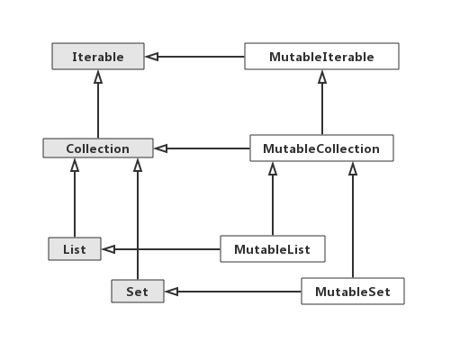

> 今天说说kotlin中的数组和集合。

我们前面说过kotlin是一门更加纯粹的面向对象的语言，所以kotlin中的数组与集合与Java中会有一些不同，但是为了性能考虑，同时因为kotlin的最终编译产物是运行在JVM之上的，还为了保持kotlin与Java良好的互操作性，所以kotlin的最终编译产物又在尽可能接近Java的编译产物。
#### 对象数组
我们在之前的代码中看到kotlin的main函数是这样写的:
```
fun main(args: Array<String>){

}
```
我们对比一下Java中的main函数写法:
```
public static void main(String[] args) {
        
}
```
可以看出kotlin中的对象数组的写法与泛型的写法很像。这就是kotlin中对象数组的声明方式，其实在kotlin中又如下三种方式可以用来创建对象数组:
1.使用arrayOf函数和指定的数组元素创建数组
```
//Java写法:
String[] params1 = {"str1", "str2", "str3"};

//kotlin写法:
val params1 = arrayOf("str1", "str2", "str3")
```

2.使用arrayOfNulls函数创建一个指定大小的并初始化每个元素为null的数组
```
//Java写法:
String[] params2 = new String[12];

//kotlin写法:
val params2 = arrayOfNulls<String>(12)
```

3.Array构造方法指定数组大小和一个生成元素的lambda表达式

这种方法创建的数组，其中的每个元素都是非空的，就像下面这样:
```
//kotlin写法:
val params3 = Array<String>(3){i -> "str" + i }
```
因为数组的原始大小已经确定，在lambda表达式中接收数组的下标，并返回一个该下标位置的值。

根据kotlin的自动推导，我们可以省略调泛型类型，根据lambda内部的it参数名，我们可以不用写出i，根据字符串模板，我们可以不使用“+”来连接字符串，所以上面的代码还可以写成这样:
```
val params3 = Array(3){"str$it"}
```
要注意的是，上面的三种方式创建的数组都是对象数组。比如你创建了Array<Int>类型的数组，那么其中的每个类型都对应了Java中的Integer类型，编译后的class文件中对应的数组的每个元素也是Integer类型。
#### 基本数据类型数组
大部分时候我们并不想创建对象类型的数组，我们就想创建像Java中的基本数据类型的数组，这时候kotlin为我们提供了下面3种函数可以创建基本数据类型的数组。
1.形如“xxxArray”这样的构造方法，每种基本数据类型都有对应的构造函数，这样的构造函数会接收一个数组大小，并使用基本数据类型的默认值初始化数组，就像下面这样:
```
val array1 = IntArray(5)
```

2.形如“xxxArrayOf”函数来指定数组原来并创建数组，就像下面这样:
```
val array2 = intArrayOf(1, 2, 3, 4)
```
上面这个函数的参数是一个可变参数，类似于Java中的可变长参数，假设我们想拿一个数组来初始化另一个数组，那我们必须要使用“*”来将一个数组进行解包(可以简单理解为展开)，然后再赋值给可边参数，就像下面这样:
```
val x = IntArray(3);
val array2 = intArrayOf(*x)
```

3.接收一个数组大小和lambda来创建数组，这种方式跟我们上面对象数组的创建方法一样，直接看下面的示例代码:
```
val array3 = IntArray(5){ it * it }
```
注意，使用上面的方法创建的数组会被编译为Java中的基本数据类型的数组，相比于对象类型的数组，少了装箱和拆箱的步骤，性能上也更好一些。

#### 集合与可空性
前面讲过kotlin中的类型又可空类型和非空类型之分，相应的，对于一个集合，我们也应该考虑到，这个集合中是否可以存储null值，对应于有包含可空值的集合和包含非空值的集合，就像下面这样:
```
//包含可空值的列表
val list1 = ArrayList<Int?>()
list1.add(null)

val list2 = ArrayList<Int>()
//不允许
//list2.add(null)
```
上面展示了在kotlin中是支持泛型的类型参数的可空性的。

同时，还要注意区分“ArrayList<Int?>”和ArrayList<Int>?的区别。前面一种表示集合本身是非空类型，但是集合中可以存储null值。后面一种表示集合本身是可空的，但是集合中只能存储非空类型的元素。
#### 只读集合和可变集合
与Java中不同，kotlin中将集合划分为只读集合和可变集合。在kotlin中有两种集合接口，一种是Collection接口，其中值包含了集合的一些基本属性，比如大小，判断某个元素是否在集合中等。另一个接口MutableCollection继承自Collection接口，并在其中添加了集合修改相关的方法，比如add、clear、remove等。

它们的继承关系图如下:

图中灰色背景的为只读集合，白色背景的为可变集合。

你会发现上图中没有Map，在kotlin中，Map不在上面的继承关系中。

kotlin为什么要这么划分呢，我的理解是，这样划分可以在编写代码的时候，如果你定义的函数传入的参数是一个只读集合，那么调用者就会明确知道这个函数并不会修改传入的集合。下面一个例子来说明一下。
```
fun main(args: Array<String>) {
    //只读集合
    val readOnlyCollection = List(10) { "str$it" }
    printList(readOnlyCollection)
}

fun printList(list: Collection<String>){
    for (x in list){
        println("元素 = $x")
    }
}
```
上面也要注意的一点是，因为只读集合并不能在后续修改，所以只读集合必须在声明时就创建好里面的元素。
这里要注意一点，只读集合并不一定是不可变的。什么意思呢？我们看看下面的代码:
```
fun main(args: Array<String>) {

    //可变集合
    val mutableList = MutableList(10){it}

    //可变集合赋值给只读集合
    val readOnlyList: List<Int> = mutableList

    //打印
    printList(readOnlyList)

    //在集合中添加元素
    mutableList.add(10)

    //再次打印
    printList(readOnlyList)
}

/**
 * 打印只读集合中的元素
 */
fun printList(list: Collection<Int>){
    for (x in list){
        println("元素 = $x")
    }
}
```
我们将一个可变集合的引用和只读集合的引用都指向了同一个集合。尽管我们的函数的参数是只读集合，没有对集合进行修改，但是我们在其他地方修改了这个集合。如果有两个函数都使用了这个集合，并且他们同时在不同的线程运行，那么其中的一个线程修改了该集合，就会造成另一个线程中对集合的读取出现异常。
所以只读集合只能作为一种约定，告诉调用方，在我的方法里面只会对你传入的集合进行读取。

下面我们看看除了上面的那种写法创建集合外，kotlin为我们提供的创建集合的函数。
|集合类型|只读|可变|
| -- | -- | -- |
|List|listOf|mutableListOf  arrayListOf|
|Set|setOf|mutableSetOf  hashSetOf linkedSetOf  sortedSetOf|
|Map|mapOf|mutableMapOf  hashMapOf  linkedMapOf  sortedMapOf|
使用上面的函数，我们可以很方便地创建出kotlin中的集合对象。
#### kotlin集合与java集合互调
kotlin中创建的集合可以直接传递给Java方法进行操作，下面看看kotlin集合与Java集合在互相调用时的一些注意点。
首先看看kotlin中声明的集合在Java中被使用时要注意的点。
1.只读集合在Java中无法被约束
如果你在kotlin中声明了一个只读的集合，在Java中只会把它当作一个普通的集合，Java可以对其进行修改，就像下面的代码一样:
```
//Java代码
import java.util.Collection;

public class Sample {
    public static void modifyCollection(Collection<String> collection){
        //传入的只读集合在kotlin中被修改
        if (collection != null){
            collection.add("xxxx");
        }

        for (String x : collection){
            System.out.println(x);
        }
    }
}

//kotlin代码
fun main(args: Array<String>) {
    //创建一个只读集合
    val list1 = listOf("str1", "str2", "str3")
    Sample.modifyCollection(list1)
}
```

2.集合类型参数非空在Java中无法被约束
在前面说过kotlin的集合可以在泛型的类型参数上约束该集合中的元素是否是非空的，但是因为Java中并没有将类型分为可空类型和非空类型，所以Java可以向集合中加入null值，就像下面这样:
```

//kotlin代码
fun main(args: Array<String>) {
    val list1: MutableCollection<String> = mutableListOf("str1", "str2", "str3")
    //报错,元素必须是非空的
    //list1.add(null)
    Sample.modifyCollection(list1)
}

//Java代码
import java.util.Collection;

public class Sample {
    public static void modifyCollection(Collection<String> collection){
        if (collection != null){
            //Java可以向集合中添加null值
            collection.add(null);
        }
    }
}
```
其实上面也很好理解，kotlin只能在kotlin相关的编译层面去判断约束非空性，如果你调用的方法在Java代码中，那kotlin是没法察觉调用者已经打破了这种约束。

下面看看Java中声明的集合，在kotlin代码中被使用时要注意的点。

我们在前面的文章中说过平台类型，在这种情况下也是平台类型，对于Java中声明的集合，在kotlin中被视为平台类型，可以是可变集合也可以是只读集合。
我们举个简单的例子说明一下:
假设Java中声明了这样一个接口:
```
//Java代码
import java.util.List;

public interface DataProcessor {
    void process(List<String> list);
}
```
上面我们声明的一个接口中的process方法中的形参是集合类型，我们看看在kotlin中我们如何实现这个接口，由于koltin中将其视为平台类型，所以在kotlin中如下的几种接口实现方式都是被允许的(具体的差异可以看代码中的注释):

1.方式1
```
class Main : DataProcessor{
    //传入的集合变量本身是非空的,
    //集合中的每个元素必须是非空的,
    //集合是可变集合
    override fun process(list: MutableList<String>) {
    }
}
```

2.方式2
```
class Main : DataProcessor{
    //传入的集合变量本身是非空的,
    //集合中的每个元素必须是非空的,
    //集合是只读集合
    override fun process(list: List<String>) {
    }
}
```

3.方式3
```
class Main : DataProcessor{
    //传入的集合变量本身是非空的,
    //集合中的每个元素是可空的,
    //集合是可变集合
    override fun process(list: MutableList<String?>) {
    }
}
```

4.方式4
```
class Main : DataProcessor{
    //传入的集合变量本身是非空的,
    //集合中的每个元素是可空的,
    //集合是只读集合
    override fun process(list: List<String?>) {
    }
}
```

5.方式5
```
class Main : DataProcessor{
    //传入的集合变量本身是可空的,
    //集合中的每个元素是非空的,
    //集合是可变集合
    override fun process(list: MutableList<String>?) {
    }
}
```

6.方式6
```
class Main : DataProcessor{
    //传入的集合变量本身是可空的,
    //集合中的每个元素是非空的,
    //集合是只读集合
    override fun process(list: List<String>?) {
    }
}
```

7.方式7
```
class Main : DataProcessor{
    //传入的集合变量本身是可空的,
    //集合中的每个元素是可空的,
    //集合是可变集合
    override fun process(list: MutableList<String?>?) {
    }
}
```

8.方式8
```
class Main : DataProcessor{
    //传入的集合变量本身是可空的,
    //集合中的每个元素是可空的,
    //集合是只读集合
    override fun process(list: List<String?>?) {
    }
}
```
由于变量本身和类型参数有可空和非空之分，集合有可变和只读之分，所以上面衍生出了8中情况，在我们具体的使用中，我们需要根据实际情况去选用合适的形式。

#### 集合与数组互相转化
最后再补充一下，可以将集合类型和数组类型进行相互，在编码过程中我们经常会用到:
```
fun main(args: Array<String>) {
    
    //声明一个数组
    val array1 = arrayListOf("str1", "str2", "str3")

    //将数组转化为集合
    val list1 = array1.toList()
    
    //将集合转化为数组
    val array2 = list1.toTypedArray()
}
```

#### 写在最后
以上就是kotlin中关于集合与数组的相关内容，可以看出，kotlin还是充分利用了Java已有的数据接口，并进行了自己的扩展，同时为了保持良好的互调性，引入了平台类型，稍微做了一部分的妥协。